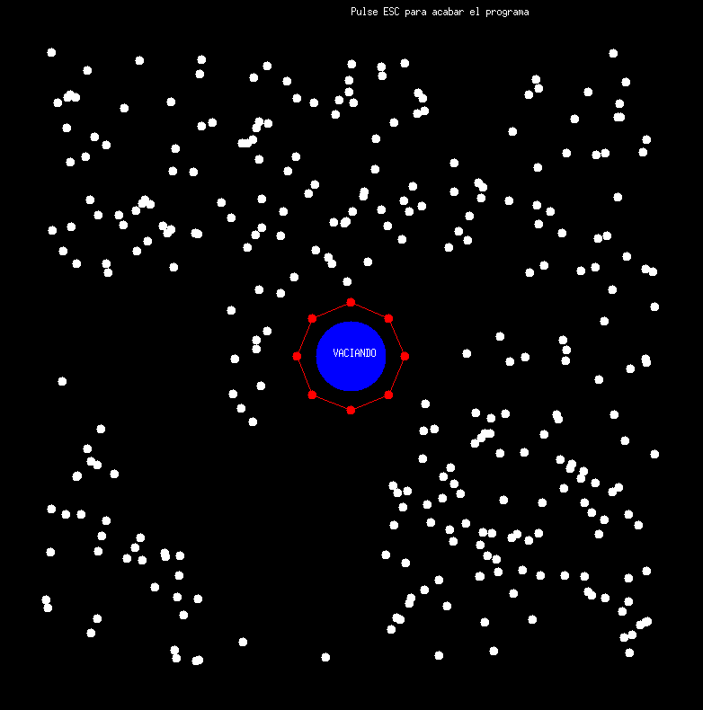

# MP
Práctica final realizada en el segundo cuatrimestre del primer curso de Ingeniería Informática en la UGR, en la asignatura de Metolodía de la Progrmación.
La idea era realizar un robot ("Wally") que 'aspirase' puntos generados aleatoriamente en el mapa.
El robot va moviendose por toda la cuadricula hasta coordenadas aleatorias aspirando todos los puntos con los que se encuentre. Una vez su depósito esté lleno, tendrá que volver al centro del mapa a vaciar todo. 
Los módulos de Pintar y Miniwin fueron proporcionados por el docente.

